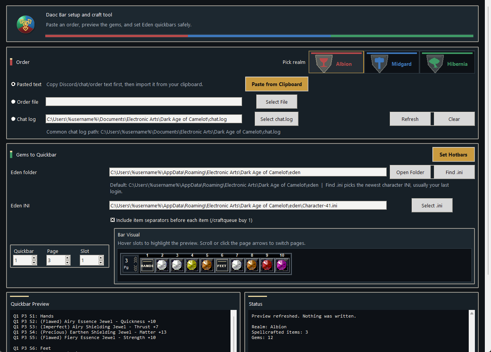
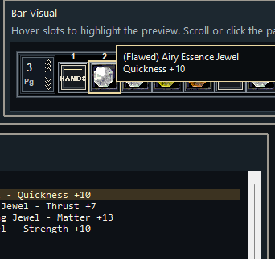
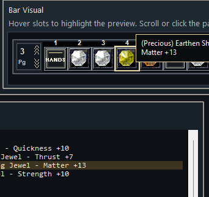

# Daoc Bar Setup And Craft Tool

Unofficial Windows tool for DAoC Eden spellcrafters.

Paste an order, open an order file, or read `chat.log`; the tool finds the spellcraft gems, shows the quickbar order, and can set your Eden hotbars after making a backup.

## Screenshots

## Features

- Paste Discord/customer text from your clipboard.
- Open Zenkcraft, Template Forge, and supported LOKI-style order files.
- Read gem names from DAoC `chat.log`.
- Preview where every gem will land on the quickbar.
- Set Eden hotbars for the gems, with optional item separator buttons.
- Back up the selected Eden `.ini` before changing anything.
- Export `.forge` or Zenkcraft `.txt` files when needed.

## First Use

1. Open `Daoc Bar setup and craft tool v3.0.2.exe`.
2. Pick the realm for the order.
3. Choose `Pasted text`, `Order file`, or `Chat log`.
4. Paste/import the order.
5. Select the Eden character `.ini`, or use `Find .ini` to pick the newest character file in the Eden folder.
6. Check the quickbar preview and bar visual.
7. Click `Set Hotbars`, or open `Show Export File Options` if you need a `.forge` or Zenkcraft `.txt`.

## Hotbar Safety

- Log out to the character screen before setting hotbars.
- Pick the correct realm before setting hotbars.
- The bar visual uses the same quickbar/page/slot math as `Set Hotbars`.
- Hover a filled visual slot to highlight the matching line in `Quickbar Preview`.
- Use the mouse wheel or the in-bar page arrows to switch quickbar pages.
- The tool updates only the selected quickbar range and the separator macros it needs.
- A timestamped `.ini` backup is created before every hotbar write.
- After a successful hotbar change, only the newest 3 tool backups are kept for that character `.ini`.
- `Restore Backup` copies a chosen backup back over the selected Eden `.ini`. It does not delete the backup.
- `Find .ini` selects the newest non-backup character `.ini` in the Eden folder, usually the last character you logged into.

## Chat Log Notes

- The normal chat log path is `C:\Users\%username%\Documents\Electronic Arts\Dark Age of Camelot\chat.log`.
- The parser uses only the newest `Chat Log Opened` session in the selected `chat.log`.
- The parser ignores normal chat noise and looks for gem names inside chat lines.
- `Refresh` reloads the selected chat log without browsing again.
- `Clear Chat Log` saves a backup copy first, then empties the selected chat log.
- Simple gem-name typos can be corrected, but missing tiers are not guessed.

## Saved Settings

- Paths inside your Windows user folder are shown as `C:\Users\%username%\...` so screenshots and shared builds point users at their own profile.
- The tool remembers the last folder used for order files, but it does not reopen the last customer/order file automatically.
- The tool remembers the selected realm, `chat.log` path, export folder, export type, open-folder checkbox, Eden `.ini`, and quickbar position.
- Export file creation is hidden under `Show Export File Options` because hotbar setup is the main workflow.

## Build From Source

See [BUILD.md](BUILD.md).

## Project Hygiene

Do not commit personal/customer files such as `.ini`, `.log`, customer order reports, generated `.exe` files, or release zips. The `.gitignore` is set up to keep those out.

## Status

Current source is v3.0.2. Albion, Midgard, and Hibernia gems are supported.

Known limits:

- A few hidden/question-mark skills from Template Forge/Zenkcraft are skipped until those tools expose usable gem names.
- Chat log and pasted text parsing can correct simple typos, but it will not guess missing tiers.
- If a Midgard order gives only a bare duplicated gem name without the stat/skill line, the tool may not know which duplicate skill was intended. Full order text avoids this.

## Disclaimer

Daoc Bar setup and craft tool © 2026 Electronic87 - A non-commercial fan project. Not affiliated with Electronic Arts, Broadsword Online Games, Mythic Entertainment, Eden-DAoC.net, DAoC Tools, Template Forge, or Zenkcraft. Dark Age of Camelot and related names, marks, and visual references belong to their respective owners.

Built by Electronic87 with AI-assisted coding support from OpenAI Codex. The author reviewed and directed the features, behavior, testing, and packaging.
